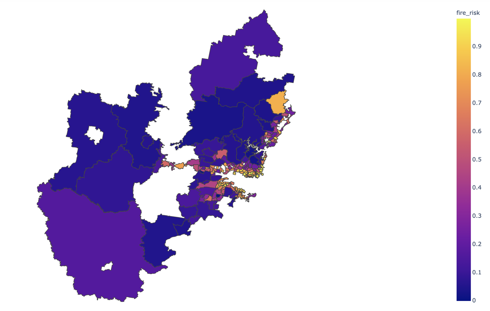

# Analysis of the Bushfire Risk Score in NSW
The Bushfire Risk Analysis project aims to provide insights into bushfire risk scores for neighborhoods in New South Wales (NSW), Australia. By integrating various datasets including census-based data, spatial data, and web-scrapped HTML data from the NSW Rural Fire Service, we conducted a comprehensive analysis to understand the factors influencing bushfire risk.

## Key Highlights:
### Data Integration:
Integration of diverse datasets to derive a holistic understanding of bushfire risk factors, including demographic, geographic, and environmental variables.

### Multiple Regression Model:
Utilization of Python and PostgreSQL for data processing and cleaning, followed by the development of a robust multiple regression model to assess the relationship between bushfire risk scores and various predictor variables.

### Correlation Analysis: 
Identification of key insights, including the mean and median bushfire risk scores across neighborhoods, as well as correlations between risk scores and socioeconomic factors such as average monthly rent and median household annual income.

## Results:
### Mean and Median Risk Scores: 
The analysis revealed a mean bushfire risk score of 0.494 and a median of 0.511 across 190 neighborhoods in NSW.

### Correlation Analysis: 
Correlation analysis indicated a weak positive correlation (coefficient = 0.258, p-value = 0.0003) between risk scores and average monthly rent, while no significant correlation (coefficient = -0.026, p-value = 0.724) was found with median household annual income.

### Geospatial Mapping: 
Creation of a geospatial map of NSW illustrating the distribution of bushfire risk scores across different regions, providing a visual representation of high-risk areas.

